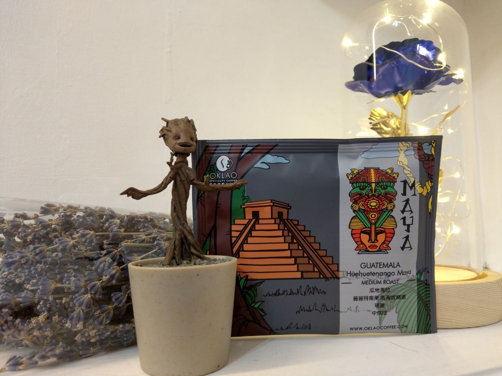
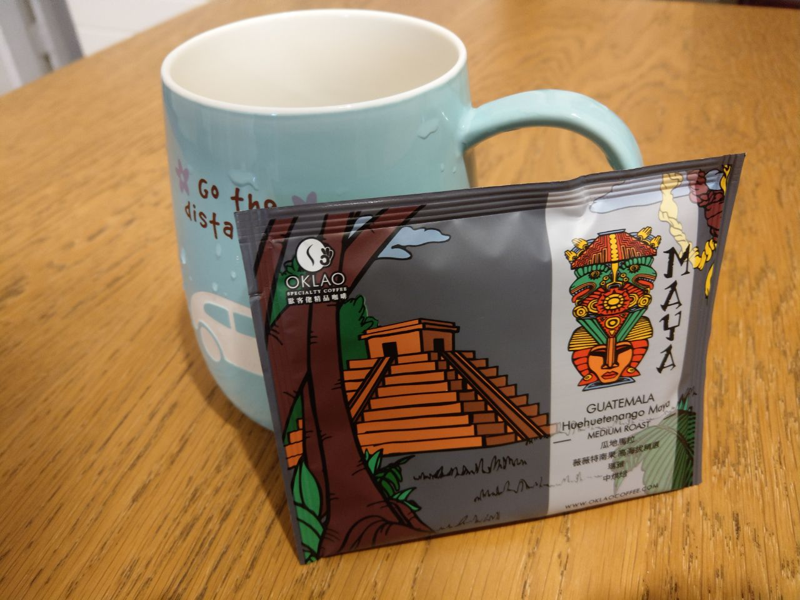

# 歐客佬精品咖啡 - 哥斯大黎加 卡內特／音樂家系列 莫札特
 獨家的音樂家系列，入口後的口感像是一首曼妙的樂曲

## 今日從媽媽那邊得到今年 2020 年令人驚喜的禮物，那就是我最愛的咖啡系列

## 開箱
- 今天要開箱的是這個[瓜地馬拉 薇薇特南果 高海拔精選 瑪雅](https://www.oklaocoffee.com/coffee/OTM/detail)咖啡

## 特色
- 啜吸：有較高的厚醇度和豐富果酸表現，微微的葡萄酒香，明顯的層次變化。

## 沖泡
- 沖泡的時候濃濃的咖啡香散落在客廰的各個角落，好似美好的愛情即將要有了結果

## 星晴小羽
- 這次的咖啡可說是有滿滿的果栗、奶油香氣，後勁是微微的果酸味，讓人愛不釋手
- 後勁有清清的咖啡香，卻又不顯得苦澀
- 謝謝我親愛的另一半媽媽給的咖啡，讓我對咖啡品味又更上了一層 ^.^

